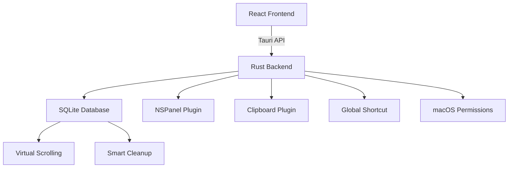

# OiCopy - 优雅的 macOS 剪贴板历史管理器

<p align="center">
  
</p>

<p align="center">
  
  
  
  
  
  
</p>

## 📋 项目简介

OiCopy 是一款专为 macOS 设计的现代化剪贴板历史管理器，采用 Tauri 架构构建，提供原生性能与优雅的用户体验。通过全局快捷键 `⌘ ⇧ V` 即可快速访问剪贴板历史，支持多种数据格式，并具备智能数据库管理和虚拟滚动等高级特性。

## ✨ 核心功能

- 🚀 **实时监控** - 自动捕获剪贴板变化，支持全局快捷键 `⌘ ⇧ V` 唤出面板
- 📊 **多格式支持** - 完美处理文本、图像、HTML、RTF、文件等多种数据类型
- 🪟 **NSPanel 集成** - 原生 macOS 浮窗体验，支持透明背景和始终置顶
- 🎯 **系统托盘** - 隐藏 Dock 图标，通过托盘菜单管理应用
- 🗄️ **SQLite 存储** - 本地数据库存储，支持智能清理和性能优化
- ⚡ **虚拟滚动** - 高性能渲染大量历史记录，流畅的用户交互
- 🔒 **权限管理** - 自动检测并引导用户授予必要的系统权限
- 🛠️ **数据维护** - 内置数据库优化工具，支持自动清理和手动维护
- 🔍 **来源追踪** - 自动识别并显示复制内容的来源应用，便于内容溯源管理

## 📱 应用截图

> 📸 演示截图待补充 - 将在后续版本中添加应用界面展示

## 🚀 安装指南

### 方式一：直接下载（推荐）

1. 前往 [Releases](https://github.com/yourusername/oicopy/releases) 页面
2. 下载最新版本的 `.dmg` 或 `.zip` 文件
3. 拖拽应用到 `/Applications` 文件夹

### 方式二：Homebrew 安装

```bash
# 暂未发布到 Homebrew，敬请期待
# brew tap yourusername/oicopy
# brew install oicopy
```

### ⚠️ 重要：权限设置

首次运行 OiCopy 需要授予以下权限：

> 📌 **系统设置 → 隐私与安全性**
> 
> - ✅ **辅助功能** - 监听全局快捷键和窗口管理
> - ✅ **完全磁盘访问权限** - 读取其他应用的剪贴板数据

应用会自动检测权限状态并引导您完成设置。

## 🎯 使用说明

### 基本操作

- **启动应用**: 首次运行会显示在系统托盘，不在 Dock 中显示
- **唤出面板**: 按下 `⌘ ⇧ V` 快捷键打开/关闭剪贴板面板
- **选择条目**: 双击或按回车键重新复制选中的历史记录
- **右键菜单**: 提供删除、固定等高级操作

### 面板界面

- **左侧区域**: 数据类型图标 + 创建时间 + 来源应用信息
- **右侧区域**: 内容预览（文本/图像/文件信息）
- **滚动浏览**: 支持鼠标滚轮和虚拟滚动优化
- **来源显示**: 显示每条记录的来源应用名称和图标，方便管理和分类

### 设置管理

通过托盘菜单 → 设置，可以访问：

- **数据保留**: 1天、1周、1个月、1年或永久保存
- **数据库维护**: 清理、优化、性能分析工具
- **一键清空**: 删除所有历史记录

## 🏗️ 技术架构



### 核心模块

- **Frontend**: React 18 + TailwindCSS + Vite
- **Backend**: Rust + Tauri 2.x + 多个系统插件
- **存储**: SQLite 本地数据库
- **权限**: macOS 辅助功能和磁盘访问检测
- **UI**: NSPanel 原生浮窗 + 系统托盘集成

## 🛠️ 开发环境

### 环境要求

```bash
# macOS 系统要求
macOS 10.15+ (Catalina)

# 开发工具
brew install rustup pnpm
rustup target add aarch64-apple-darwin x86_64-apple-darwin
```

### 本地运行

```bash
# 克隆仓库
git clone https://github.com/yourusername/oicopy.git
cd oicopy

# 安装依赖
pnpm install

# 开发模式启动
pnpm tauri dev

# 构建生产版本
pnpm tauri build
```

### 🚧 开发调试

如果遇到端口占用问题，可以使用以下命令清理并重启开发环境：

```bash
lsof -i :1420 | awk 'NR>1 {print $2}' | xargs kill -9 && RUST_BACKTRACE=full pnpm tauri dev
```

### 常用脚本

| 命令 | 描述 |
|------|------|
| `pnpm dev` | 启动前端开发服务器 |
| `pnpm build` | 构建前端生产版本 |
| `pnpm test` | 运行单元测试 |
| `pnpm tauri dev` | 启动完整开发环境 |
| `pnpm tauri build` | 构建应用安装包 |

## 📁 项目结构

```
oicopy/
├── src/                          # React 前端源码
│   ├── components/               # 组件库
│   │   ├── PanelPage.jsx        # 主面板组件
│   │   ├── Settings.jsx         # 设置页面
│   │   ├── VirtualScrollContainer.jsx # 虚拟滚动
│   │   └── DatabaseOptimization/ # 数据库优化
│   ├── utils/                   # 前端工具函数
│   └── assets/                  # 静态资源
├── src-tauri/                   # Rust 后端源码
│   ├── src/
│   │   ├── clipboard_management.rs # 剪贴板管理
│   │   ├── db.rs               # 数据库操作
│   │   ├── panel_window.rs     # 窗口管理
│   │   ├── settings.rs         # 应用设置
│   │   └── performance_optimization.rs # 性能优化
│   ├── Cargo.toml              # Rust 依赖配置
│   └── tauri.conf.json         # Tauri 应用配置
├── public/                      # 静态文件
├── docs/                        # 文档和截图
└── README.md                    # 项目说明
```

## 🔧 技术栈

### 前端技术
- **React 18** - 现代化 UI 框架
- **TailwindCSS 4** - 实用优先的 CSS 框架
- **Vite 6** - 快速的构建工具
- **@tanstack/react-virtual** - 高性能虚拟滚动
- **dayjs** - 轻量级日期处理

### 后端技术
- **Rust 1.77+** - 系统级编程语言
- **Tauri 2.x** - 跨平台桌面应用框架
- **SQLite** - 轻量级嵌入式数据库
- **tokio** - 异步运行时
- **serde** - 序列化/反序列化框架

### 系统集成
- **tauri-nspanel** - macOS NSPanel 支持
- **tauri-plugin-clipboard** - 剪贴板 API
- **tauri-plugin-global-shortcut** - 全局快捷键
- **tauri-plugin-macos-permissions** - macOS 权限管理

## 🗺️ 路线图

### 当前版本 (v0.1.0)
- ✅ 基础剪贴板历史记录功能
- ✅ NSPanel 浮窗集成
- ✅ 系统托盘支持
- ✅ 权限检测与设置
- ✅ 数据库优化工具
- ✅ **来源应用识别** - 自动标识复制内容的来源应用
- ✅ **来源信息展示** - 在剪贴板历史记录中显示来源应用信息

### 计划功能
- 📱 **云同步支持** - 跨设备同步剪贴板历史
- 🎨 **主题定制** - 深色模式和自定义主题
- 🔍 **全文搜索** - 快速查找历史记录
- 📝 **收藏夹功能** - 固定重要的剪贴板内容

## 🤝 贡献指南

我们欢迎各种形式的贡献！

### 提交代码

1. Fork 本仓库
2. 创建特性分支: `git checkout -b feature/amazing-feature`
3. 提交更改: `git commit -m 'feat: add amazing feature'`
4. 推送分支: `git push origin feature/amazing-feature`
5. 提交 Pull Request

### 开发规范

- 遵循 [Conventional Commits](https://conventionalcommits.org/) 提交信息格式
- 使用 `pnpm test` 确保测试通过
- 代码格式化使用 Prettier 和 rustfmt
- 新功能请添加相应的测试用例

### 问题反馈

- 🐛 **Bug 报告**: 使用 [Bug Report](https://github.com/yourusername/oicopy/issues/new?template=bug_report.md) 模板
- 💡 **功能建议**: 使用 [Feature Request](https://github.com/yourusername/oicopy/issues/new?template=feature_request.md) 模板

## 📄 许可证

MIT © 2025 OiCopy Authors

本项目基于 [MIT 许可证](LICENSE) 开源，您可以自由使用、修改和分发。

---

<p align="center">
  <a href="#oicopy---优雅的-macos-剪贴板历史管理器">⬆️ 回到顶部</a>
</p>

<p align="center">
  如果这个项目对您有帮助，请考虑给它一个 ⭐
</p>
